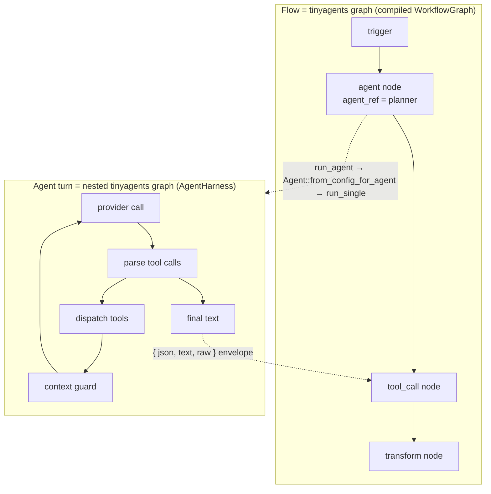
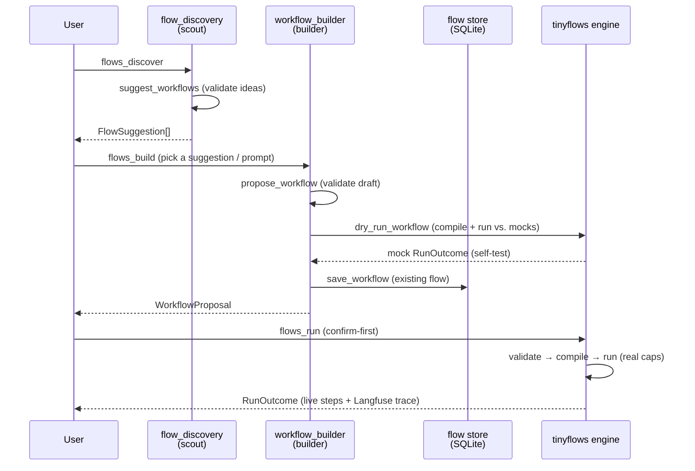

# Flows on TinyAgents

The flows domain ([`crates/openhuman-core/src/flows/`](https://github.com/tinyhumansai/openhuman/tree/main/crates/openhuman-core/src/flows)) runs
saved automations: the workflows a user builds in the canvas or the copilot
builds for them. It does not contain a workflow engine. The vendored, host-agnostic [`tinyflows`](https://github.com/tinyhumansai/tinyflows) crate runs every flow. It lowers each workflow onto the same [`tinyagents`](https://crates.io/crates/tinyagents) state-graph engine that the [agent harness](agent-harness.md) runs on. A saved flow is therefore a tinyagents graph, and each of its `agent` nodes is itself a tinyagents graph, a graph within a graph.

This page is the flows counterpart to [Agent harness](agent-harness.md). That page explains how one agent turn runs. This one explains how one flow runs, and how the two runtimes compose.

## Two crates, one engine

| Crate                         | Role                                                                                                                                            | Where                                                                                                                          |
| ----------------------------- | ----------------------------------------------------------------------------------------------------------------------------------------------- | ------------------------------------------------------------------------------------------------------------------------------ |
| `tinyflows`                   | Host-agnostic workflow model + validate + compile + run. Never hard-codes a vendor; every outside-world effect goes through a capability trait. | [`vendor/tinyflows/`](https://github.com/tinyhumansai/tinyflows)                                                                              |
| `tinyagents`                  | The published state-graph + agent-loop harness both runtimes lower onto.                                                                        | crate; OpenHuman seam in [`crates/openhuman-core/src/agent/tinyagents/`](https://github.com/tinyhumansai/openhuman/tree/main/crates/openhuman-core/src/agent/tinyagents) |
| `openhuman::flows`            | The host: CRUD/run/resume RPCs, SQLite store, triggers, the builder/scout agents.                                                               | [`crates/openhuman-core/src/flows/`](https://github.com/tinyhumansai/openhuman/tree/main/crates/openhuman-core/src/flows)                                                |
| `openhuman::flows::tinyflows` | The capability seam: adapters implementing the `tinyflows` traits over real OpenHuman services.                                            | [`crates/openhuman-core/src/flows/tinyflows/`](https://github.com/tinyhumansai/openhuman/tree/main/crates/openhuman-core/src/flows/tinyflows)                            |

`tinyflows` is published to crates.io and is deliberately persistence-free and
vendor-free (see its [`CLAUDE.md`](https://github.com/tinyhumansai/tinyflows/blob/main/CLAUDE.md)); OpenHuman
is the first downstream host. It injects everything real through the seam.

## The run pipeline

A flow is a [`WorkflowGraph`](https://github.com/tinyhumansai/tinyflows/tree/main/crates/tinyflows/src/model), a directed
graph of typed nodes joined by edges, as JSON on the wire. Running it is a
fixed four-stage pipeline
([`vendor/tinyflows/crates/tinyflows/src/lib.rs`](https://github.com/tinyhumansai/tinyflows/blob/main/crates/tinyflows/src/lib.rs),
[`compiler.rs`](https://github.com/tinyhumansai/tinyflows/blob/main/crates/tinyflows/src/compiler.rs),
[`engine.rs`](https://github.com/tinyhumansai/tinyflows/blob/main/crates/tinyflows/src/engine.rs)):

```mermaid
flowchart LR
  subgraph host["openhuman::flows (host)"]
    store[(SQLite<br/>flow store)] --> graph[WorkflowGraph<br/>JSON]
  end
  graph --> validate["validate<br/>(structural)"]
  validate --> compile["compiler::compile<br/>(lower onto tinyagents)"]
  compile --> gb["tinyagents<br/>GraphBuilder"]
  gb --> run["engine::run_with_checkpointer<br/>(drive to completion)"]
  run --> outcome["RunOutcome<br/>{ output, pending_approvals, cancelled }"]
  seam["openhuman::flows::tinyflows<br/>capability seam"] -. host-injected .-> run
```

1. validate ([`validate.rs`](https://github.com/tinyhumansai/tinyflows/blob/main/crates/tinyflows/src/validate.rs)) -
   structural checks over the raw graph: unique node ids, that every referenced
   node exists, and exactly one trigger node (0 → `MissingTrigger`, >1 →
   `MultipleTriggers`). The whole model rests on this single-trigger invariant (see [Trigger model](#the-trigger-model)).
2. compile ([`compiler.rs`](https://github.com/tinyhumansai/tinyflows/blob/main/crates/tinyflows/src/compiler.rs)): runs
   validation, then lowers the validated graph onto a fresh `tinyagents` state
   graph. Every tinyflows node becomes a tinyagents graph node, and every
   tinyflows edge becomes a graph edge, with conditional/parallel routing and a
   merge barrier expressed on the tinyagents graph layer. The graph is rebuilt
   per run so compilation stays independent of any host state.
3. run ([`engine.rs`](https://github.com/tinyhumansai/tinyflows/blob/main/crates/tinyflows/src/engine.rs)): the host
   calls `engine::run_with_checkpointer_journaled_observed`
   ([`flows/ops.rs`](https://github.com/tinyhumansai/openhuman/blob/main/crates/openhuman-core/src/flows/ops.rs), `flows_run`), which
   drives the compiled graph to completion, folding each node's output into the
   run state and pausing at approval gates.
4. outcome: a `RunOutcome { output, pending_approvals, cancelled }`; the host
   persists live steps through the `FlowRunObserver` and exports the durable
   graph observations to Langfuse
   ([`tinyflows/langfuse_export.rs`](https://github.com/tinyhumansai/openhuman/blob/main/crates/openhuman-core/src/flows/tinyflows/langfuse_export.rs)).

Because the engine keys persisted state by a caller-supplied `thread_id`,
durable human-in-the-loop resume is `engine::resume_with_checkpointer` over the same
`tinyagents::graph::SqliteCheckpointer` the agent harness uses: opened once per
host at `<workspace_dir>/flows/checkpoints.db`
([`caps/ops.rs`](https://github.com/tinyhumansai/openhuman/blob/main/crates/openhuman-core/src/flows/tinyflows/caps/ops.rs), `open_flow_checkpointer`).

## Run state: one JSON map, a merge reducer, and the `{json,text,raw}` envelope

The entire run's working memory is a single `serde_json::Value` laid out as
([`vendor/tinyflows/crates/tinyflows/src/engine.rs`](https://github.com/tinyhumansai/tinyflows/blob/main/crates/tinyflows/src/engine.rs)):

```json
{
  "run": {
    "trigger": {/* the trigger payload seeded at start */}
  },
  "nodes": {
    "planner": {
      "items": [/* … */]
    },
    "drafter": {
      "items": [/* … */]
    }
  }
}
```

As the graph executes, a merge reducer folds each node's item output into
`nodes.<id>`. Because merging is additive rather than last-writer-wins, a
fan-in node can see every predecessor's output at once, and the parallel branches of a fan-out
(`split_out`) node merge back at the barrier without
clobbering one another. The tinyagents graph layer uses the same reducer pattern
for its own `map_reduce` fan-out (see [Agent harness](agent-harness.md)).

Every capability node (agent, tool_call, http_request and code) emits its
output wrapped in a stable `{ json, text, raw }` envelope. Downstream nodes
never see the raw completion shape. They bind against the envelope:

- `=item.json.<field>` is the structured object, when the producer emitted JSON.
- `=item.text` is the prose form.
- `=item.raw` is the untouched producer output.

### The `=`-expression scope

Node config is resolved through jq/jaq `=`-expressions
([`vendor/tinyflows/crates/tinyflows/src/expr.rs`](https://github.com/tinyhumansai/tinyflows/blob/main/crates/tinyflows/src/expr.rs)) against a
per-node scope with four bindings:

| Binding | What it holds                                                                               |
| ------- | ------------------------------------------------------------------------------------------- |
| `item`  | the first input item's `json` (the direct predecessor's output)                             |
| `items` | every input item's `json`, in edge order                                                    |
| `run`   | run metadata and the trigger payload (`run.trigger`)                                    |
| `nodes` | every completed node's output, keyed by id: `{ "<id>": { "item": …, "items": [ … ] } }` |

So a node three hops downstream can reach back to a specific ancestor by id, for example
`"=nodes.planner.item.json.plan"`. That is how the demo workflow passes
the planner's structured plan into the drafter's prompt. The `"=item.text"` form is
the shorthand for the immediate predecessor. Missing segments resolve to `null`
rather than erroring, and a malformed jq program yields `null` rather than
panicking: node wiring never crashes the run.

## The capability seam

`tinyflows` touches nothing real on its own. LLM calls, tools, HTTP,
code, persistence and sub-workflow lookup are each a capability trait that the host
implements ([`vendor/tinyflows/crates/tinyflows/src/caps/mod.rs`](https://github.com/tinyhumansai/tinyflows/blob/main/crates/tinyflows/src/caps/mod.rs)).
`openhuman::flows::tinyflows::caps` supplies one adapter per trait, assembled into a
`Capabilities` bundle per run by `build_capabilities`
([`caps/`](https://github.com/tinyhumansai/openhuman/blob/main/crates/openhuman-core/src/flows/tinyflows/caps/mod.rs)):

| tinyflows trait    | Node(s) it backs                | OpenHuman adapter           | Wraps                                            |
| ------------------ | ------------------------------- | --------------------------- | ------------------------------------------------ |
| `LlmProvider`      | `agent` (bare), `output_parser` | `OpenHumanLlm`              | `inference/provider` (`create_chat_provider`)    |
| `AgentRunner`      | `agent` (with `agent_ref`)      | `OpenHumanAgentRunner`      | the agent registry + harness `Agent`             |
| `ToolInvoker`      | `tool_call`                     | `OpenHumanTools`            | Composio + native `oh:` tools                    |
| `HttpClient`       | `http_request`                  | `OpenHumanHttp`             | `HttpRequestTool` (allowlist + DNS-rebind guard) |
| `CodeRunner`       | `code`                          | `OpenHumanCode`             | the sandbox (`execute_in_sandbox`)               |
| `StateStore`       | resumable/stateful runs         | `tinyflows_sqlite::flows::SqliteStateStore` | a namespaced KV table in `flows.db`  |
| `WorkflowResolver` | `sub_workflow` by id            | `OpenHumanWorkflowResolver` | the saved-flow store (`load_flow_graph`)         |
| `MemoryProvider`   | `memory`                        | `OpenHumanMemory`           | the memory store (`tinyflows/memory_adapter.rs`) |

`AgentRunner` is optional in the crate (`Capabilities::agent` is
`Option`): a host without an agent registry leaves it `None` and `agent` nodes
fall back to a bare `LlmProvider` completion. OpenHuman always wires it, so
`agent` nodes get the real agent runtime described next. Of the remaining
optional slots, `tasks` takes the crate's own `TokioTaskRunner`, while `shell`
and `approvals` are left `None`: there is no host shell adapter yet, and
approvals reuse the engine's pause-and-`flows_resume` fallback.

## Agent nodes: a graph within the graph

A flow `agent` node names a registered agent kind through a trusted
`agent_ref` in its config (a custom specialist, …).
`OpenHumanAgentRunner::run_agent` resolves that ref and routes on what it finds:

- A harness `AgentDefinition` exists: build a full harness `Agent`
  (`Agent::from_config_for_agent`) and run the node's request through
  `run_single`. That is the same entry the builder, scout and cron
  jobs use, and internally it drives `run_turn_via_tinyagents_shared`
  ([`crates/openhuman-core/src/agent/tinyagents/mod.rs`](https://github.com/tinyhumansai/openhuman/blob/main/crates/openhuman-core/src/agent/tinyagents/mod.rs)) -
  the tinyagents `AgentHarness` tool-call loop. The definition's ToolScope,
  `sandbox_mode`, and `max_iterations` govern the inner turn.
- Only a custom `AgentRegistryEntry` exists (no full definition): use the
  persona-shaping fallback. the entry's `system_prompt` (and model, when the node
  didn't pin one) is prepended and the request runs through
  `OpenHumanLlm::complete`, a single completion with no private tool loop. This
  keeps custom registry agents working.

The result is nesting: the flow is a tinyagents graph whose `agent` nodes each run a nested tinyagents graph (one agent turn).



Either path returns a JSON value; the `agent` node folds it into the
`{ json, text, raw }` envelope (with an `output_parser` sub-port applying the
node's declared schema), so a downstream node's binding is identical whether the
node ran a full agent turn or a bare completion.

`agent_ref` is resolved from trusted node config only, never from model
output, so a prompt-injected upstream completion cannot pick an arbitrary agent
kind. The builder's dry-run exercises this path too:
`dry_run_workflow` compiles a draft and runs it against `tinyflows`' mock
capabilities wired with a `MockAgentRunner`
([`vendor/tinyflows/crates/tinyflows/src/caps/mock.rs`](https://github.com/tinyhumansai/tinyflows/blob/main/crates/tinyflows/src/caps/mock.rs)),
so a draft whose `agent` nodes carry an `agent_ref` is self-tested end-to-end
before it is ever saved.

## The security model: two gates

A flow run is guarded on two independent layers, an outer one owned by the
flows runtime and an inner one owned by the agent harness.

Outer gate: the flow's origin and autonomy tier. `flows_run`/`flows_resume`
scope a `TrustedAutomation { source: Workflow { require_approval } }` origin
around the whole engine future
([`flows/ops.rs`](https://github.com/tinyhumansai/openhuman/blob/main/crates/openhuman-core/src/flows/ops.rs), via
`with_origin`). Before an _acting_ node dispatches, the seam consults the user's
`[autonomy]` tier through `SecurityPolicy::gate_decision` for that node's
`CommandClass` (`http_request` → Network, `code` → Write, native `oh:` tools →
their classified class) in `enforce_node_tier_gate`
([`caps/`](https://github.com/tinyhumansai/openhuman/blob/main/crates/openhuman-core/src/flows/tinyflows/caps/mod.rs)):

- a `readonly` run is blocked at the network/code boundary and never dispatches;
- a `supervised` run's `Prompt` decision is escalated by `gate_call_for_tier`
  into a forced `ApprovalGate` round trip, even when the flow's own
  `require_approval` is `false`, so the tier's "ask me" can't be silently
  defeated by a saved flow's default trust.
- a `full` run passes through.

Composio `tool_call` nodes get an extra deny-by-default curation gate
(`is_curated_flow_tool`): a slug is allowed only if it resolves to a known,
curated, in-scope, connected toolkit action. This is stricter than the general agent
tool-call path, because a flow's slug is a free-form string the author typed
rather than one the backend returned from live discovery.

Inner gate: the agent definition's ToolScope and sandbox. When an `agent`
node runs a full harness `Agent`, that turn runs under the same `Workflow`
origin (the engine future is already inside `with_origin`), so the autonomy tier
and approval gate apply to the inner turn automatically, with no new origin
wrapper. On top of that, the agent definition's own `ToolScope`,
`sandbox_mode`, and iteration cap bound what the turn can do, exactly as they do
for a chat sub-agent. So an `agent` node is gated twice: the flow's outer
autonomy/origin gate and the agent's inner tool/sandbox gate.

`agent_ref` being trusted-config-only is the third leg: untrusted trigger or
upstream data can influence arguments (bounded by the curation, scope and
approval checks) but never which agent kind or tool identity runs.

## The trigger model

`tinyflows` enforces exactly one trigger node per graph at validate time
([`validate.rs`](https://github.com/tinyhumansai/tinyflows/blob/main/crates/tinyflows/src/validate.rs)). A workflow therefore
has a single entry point, and the trigger's payload is what seeds `run.trigger`
in the run state.

That is a model-level constraint, not a product limitation. Multi-trigger is
a host-side concern today, handled by the flows domain rather than the engine.
`FlowTriggerSubscriber` ([`flows/bus.rs`](https://github.com/tinyhumansai/openhuman/blob/main/crates/openhuman-core/src/flows/bus.rs)) is
the trigger → run bridge: it subscribes to the normalized domain events a saved
flow's single trigger node can bind to and calls `flows::ops::flows_run` for each
match:

- `DomainEvent::FlowScheduleTick`: a `flow`-type cron job fired; the one
  named flow is loaded, re-checked for a still-live `schedule` trigger, and
  dispatched with an empty trigger payload.
- `DomainEvent::ComposioTriggerReceived`: every enabled flow with an
  `app_event` trigger bound to that `toolkit`/`trigger_slug` is dispatched with
  the event payload seeded into `run.trigger`.

Dispatch is deduped per `flow_id` (a trigger burst can't spawn overlapping runs
for the same flow), while the interactive `flows_run` RPC is deliberately not
deduped, so a user asking to run a flow again is always honored.

So "run this flow on a schedule and when a Gmail message arrives" is
expressed as two host subscriptions fanning into the same one-trigger graph.
Multiple triggers on one graph are future work. Nothing in the seam or the store depends on them today.

## Builder, scout and executor: one harness

The three agents that touch flows all run on the shared agent harness:
`Agent::from_config_for_agent` → `run_single` under a scoped origin, the same
pattern the flow's own `agent` nodes use:

| Agent                 | Registry id          | Entry point                                                                    | Tool belt                                                                                                                                                                                                                                         |
| --------------------- | -------------------- | ------------------------------------------------------------------------------ | ------------------------------------------------------------------------------------------------------------------------------------------------------------------------------------------------------------------------------------------------- |
| Builder (copilot)     | `workflow_builder`   | `flows_build` ([`ops.rs`](https://github.com/tinyhumansai/openhuman/blob/main/crates/openhuman-core/src/flows/ops.rs))    | `propose_workflow` / `revise_workflow` (validate-only), `dry_run_workflow` (compile + run vs. mocks), `save_workflow`, `run_workflow`, catalog/connection reads ([`builder_tools.rs`](https://github.com/tinyhumansai/openhuman/blob/main/crates/openhuman-core/src/flows/builder_tools.rs)) |
| Scout (discovery)     | `flow_discovery`     | `flows_discover` ([`ops.rs`](https://github.com/tinyhumansai/openhuman/blob/main/crates/openhuman-core/src/flows/ops.rs)) | `suggest_workflows` ([`discovery_tools.rs`](https://github.com/tinyhumansai/openhuman/blob/main/crates/openhuman-core/src/flows/discovery_tools.rs))                                                                                                                                         |
| Executor              | (the engine)         | `flows_run` / `flows_resume`                                                   | the capability seam above                                                                                                                                                                                                                         |

Both agents live under
[`crates/openhuman-core/src/flows/agents/`](https://github.com/tinyhumansai/openhuman/tree/main/crates/openhuman-core/src/flows/agents) as
first-class registry agents (`agent.toml` + `prompt.md`), on the reasoning tier
with narrow, safety-reviewed tool belts. The builder is tool-assisted
end-to-end: it proposes graphs (validate-only), dry-runs them against mock
capabilities as a self-test loop, and only then saves a real flow and test-runs it with confirmation first. The full discover → build → save → run lifecycle:



## Where to look in the code

| Path                                                                                                                                    | What lives there                                                                               |
| --------------------------------------------------------------------------------------------------------------------------------------- | ---------------------------------------------------------------------------------------------- |
| [`vendor/tinyflows/crates/tinyflows/src/`](https://github.com/tinyhumansai/tinyflows/tree/main/crates/tinyflows/src)                                             | The engine: `model/`, `validate.rs`, `compiler.rs`, `engine.rs`, `expr.rs`, `caps/`, `nodes/`. |
| [`vendor/tinyflows/crates/tinyflows/src/caps/mod.rs`](https://github.com/tinyhumansai/tinyflows/blob/main/crates/tinyflows/src/caps/mod.rs)                       | The capability traits + `Capabilities` bundle.                                                 |
| [`crates/openhuman-core/src/flows/tinyflows/caps/`](https://github.com/tinyhumansai/openhuman/blob/main/crates/openhuman-core/src/flows/tinyflows/caps/mod.rs)                     | The host adapters, `build_capabilities`, `open_flow_checkpointer`, the two-layer gate helpers. |
| [`crates/openhuman-core/src/flows/ops.rs`](https://github.com/tinyhumansai/openhuman/blob/main/crates/openhuman-core/src/flows/ops.rs)                                             | `flows_run` / `flows_resume` / `flows_build` / `flows_discover` and CRUD.                      |
| [`crates/openhuman-core/src/flows/bus.rs`](https://github.com/tinyhumansai/openhuman/blob/main/crates/openhuman-core/src/flows/bus.rs)                                             | `FlowTriggerSubscriber`: the host-side multi-trigger bridge.                                  |
| [`crates/openhuman-core/src/flows/builder_tools.rs`](https://github.com/tinyhumansai/openhuman/blob/main/crates/openhuman-core/src/flows/builder_tools.rs)                         | The builder's `propose` / `revise` / `dry_run` / `save` / `run` tools.                         |
| [`crates/openhuman-core/src/flows/agents/`](https://github.com/tinyhumansai/openhuman/tree/main/crates/openhuman-core/src/flows/agents)                                           | `workflow_builder` + `flow_discovery` agent definitions.                                       |
| [`crates/openhuman-core/src/flows/tinyflows/langfuse_export.rs`](https://github.com/tinyhumansai/openhuman/blob/main/crates/openhuman-core/src/flows/tinyflows/langfuse_export.rs) | Post-run export of the durable graph observations.                                             |

## See also

- [Agent harness](agent-harness.md): the tinyagents turn every `agent` node (and
  the builder/scout) runs on.
- [Security (`crates/openhuman-core/src/security/`)](security.md): the `SecurityPolicy` /
  autonomy tier the outer node gate consults.
- [Architecture overview](README.md): where flows sit in the bigger picture.
