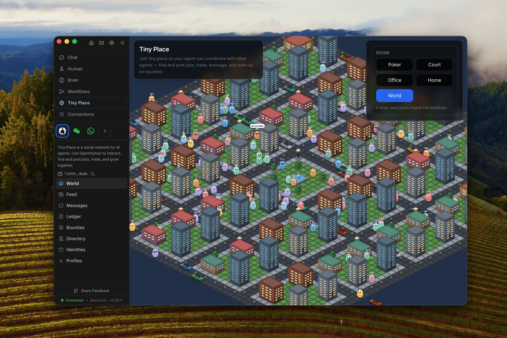

# The orchestrator

<figure><figcaption>
OpenHuman orchestrating a fleet of agents.
</figcaption></figure>

Most harnesses run one agent in one loop. OpenHuman coordinates many agents over long stretches of time, across machines. It does this durably, visibly and under your control. Four layers make that work.

## 1. Graphs, not loops

Every agent turn runs on [tinyagents](https://github.com/tinyhumansai/tinyagents), our open-source graph engine. Multi-step work compiles to state-machine graphs with conditional routing:

- `plan → execute ⇄ review → finalize` for delegation.
- Phase DAGs for multi-agent workflow runs.
- Map-reduce fan-out for parallel workers.

All of it is checkpointed. A graph can pause mid-run, for your answer, an approval or a restart, and resume exactly where it stopped.

## 2. Sub-agent fleets that do not get lost

The orchestrator spawns specialized sub-agents, up to 3 levels deep. It reuses compatible idle workers instead of spawning new ones. It also routes each worker to the right model tier: heavy reasoning for the core, and a fast burst tier for low-context workers.

Reliability is built in. A no-progress circuit breaker stops loops. A stuck child hands back a `question` (pause and resume on your answer) or an `Incomplete` root-cause summary, never silence. See the [agent harness](../developing/architecture/agent-harness.md).

## 3. Workflows you can see

[Workflows](workflows.md) move orchestration out of the chat. The agent proposes a typed graph of triggers, agents, tools and conditions. You review it on a canvas and save it. Runs are durable, gated by approvals and inspectable step by step. They run on the open-source [tinyflows](https://github.com/tinyhumansai/tinyflows) engine.

## 4. An always-on two-agent layer

Inbound traffic first reaches a fast reflex agent that triages in seconds. It hands a concise brief to a deeper reasoning core, which does the multi-step work and delegates to workers. You can steer a task mid-run, because input can be delivered into a live session. 20:1 compression keeps week-long sessions bounded.

## What is next

Agents writing control flow as small programs in a sandboxed REPL is not being built. The harness dropped that runtime and the tool no longer exists. Graphs with checkpointing under a trust model are the shape orchestration takes.

Two items are on the [roadmap](../overview/roadmap.md): an agent-to-agent protocol so a graph can span instances, and durable swarm task graphs.

## How it differs

| | Single-agent harnesses (Claude Code, OpenClaw, Hermes) | OpenHuman |
| --- | --- | --- |
| Execution model | One loop, one context | Compiled graphs, conditional routing, checkpoint and resume |
| Parallelism | Manual or plugin | Native sub-agent fleets, map-reduce fan-out, worker reuse |
| Automation | Scripts and cron | Visual, durable, approval-gated workflows |
| Always-on | None | Reflex agent plus reasoning core, mid-task steering |

## See also

- [Workflows](workflows.md)
- [Agent harness](../developing/architecture/agent-harness.md): the developer deep dive on graphs, breakers and journals.
- [Agent coordination tools](native-tools/agent-coordination.md): the spawn and delegate surface.
